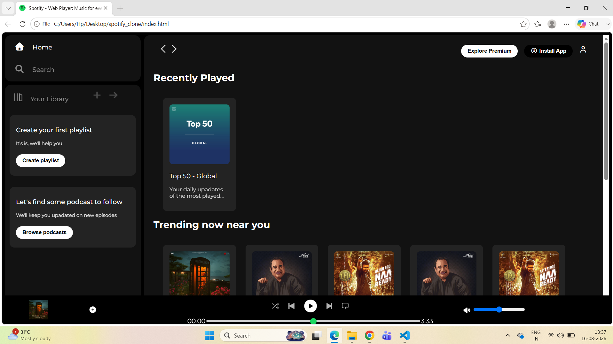

# 🎵 Spotify Clone

A **Spotify Web Player UI Clone** built using **HTML and CSS**. This project recreates the look and layout of Spotify's web player with a dark-themed interface, navigation sidebar, music cards, library section, and bottom music player.

## 📌 Project Overview

The Spotify Clone is a frontend web development project created to practice and demonstrate modern web design concepts using HTML and CSS.

The project focuses on recreating the **Spotify-inspired user interface**, including its navigation, library, music cards, charts, and music player components.

## ✨ Features

* 🏠 Home navigation
* 🔍 Search navigation
* 📚 Your Library section
* ➕ Create Playlist option
* 🎙️ Podcast section
* 🎵 Recently Played section
* 🔥 Trending Now section
* 📊 Featured Charts section
* ⏮️ Previous and next player controls
* ▶️ Music player interface
* ⏱️ Music progress bar
* 🔊 Volume control
* 👤 User profile icon
* 🎨 Spotify-inspired dark UI
* 📱 Responsive layout for different screen sizes

## 🛠️ Technologies Used

| Technology   | Purpose                      |
| ------------ | ---------------------------- |
| HTML5        | Webpage structure            |
| CSS3         | Styling and layout           |
| CSS Flexbox  | Page and component alignment |
| Font Awesome | Icons                        |
| Google Fonts | Typography                   |
| Git          | Version control              |
| GitHub       | Source code hosting          |

## 📂 Project Structure

```text
Spotify_Clone/
│
├── assets/
│   ├── logo.png
│   ├── library_icon.png
│   ├── backward_icon.png
│   ├── forward_icon.png
│   ├── player_icon1.png
│   ├── player_icon2.png
│   ├── player_icon3.png
│   ├── player_icon4.png
│   ├── player_icon5.png
│   ├── card1img.jpeg
│   ├── card2img.jpeg
│   ├── card3img.jpeg
│   ├── card4img.jpeg
│   ├── card5img.jpeg
│   ├── card6img.jpeg
│   └── preview.png
│
├── index.html
├── style.css
└── README.md
```

## 🚀 How to Run the Project

### 1. Clone the repository

```bash
git clone https://github.com/shivani-rajput03/Spotify_Clone.git
```

### 2. Navigate to the project folder

```bash
cd Spotify_Clone
```

### 3. Open the project

Open `index.html` in your web browser.

You can also open the project in **Visual Studio Code** and use the **Live Server** extension to run it.

## 🖥️ Project Preview



## 🎯 Learning Objectives

Through this project, I practiced:

* Creating webpage structures using HTML5
* Designing modern interfaces using CSS3
* Using Flexbox for responsive layouts
* Creating reusable UI components
* Working with local images and assets
* Using external fonts and icon libraries
* Implementing responsive design
* Managing source code using Git
* Hosting projects on GitHub

## 🔮 Future Improvements

The project can be enhanced in the future by adding:

* 🎵 Real music playback
* ▶️ Functional play/pause controls
* ⏭️ Previous and next song functionality
* 🔊 Functional volume control
* 🔍 Working search functionality
* ❤️ Like and favorite functionality
* 🎶 Dynamic playlists
* 📱 Improved mobile responsiveness
* 🌐 JavaScript-based interactive features
* 🔐 User authentication

## 👩‍💻 Author

### Shivani Rajput

**Computer Science & Engineering Student**
PDA College of Engineering, Kalaburagi

* 💻 GitHub: [shivani-rajput03](https://github.com/shivani-rajput03)
* 🔗 LinkedIn: [Shivani Rajput](https://www.linkedin.com/in/shivani-rajput-042046342)

## ⚠️ Disclaimer

This project is created **for educational and learning purposes**. It is a frontend UI clone inspired by Spotify's web player and is not affiliated with or endorsed by Spotify.

## ⭐ Support

If you found this project useful for learning frontend development, consider giving the repository a ⭐ on GitHub.
